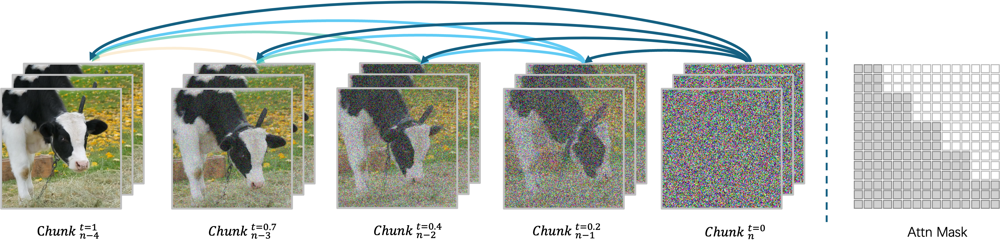
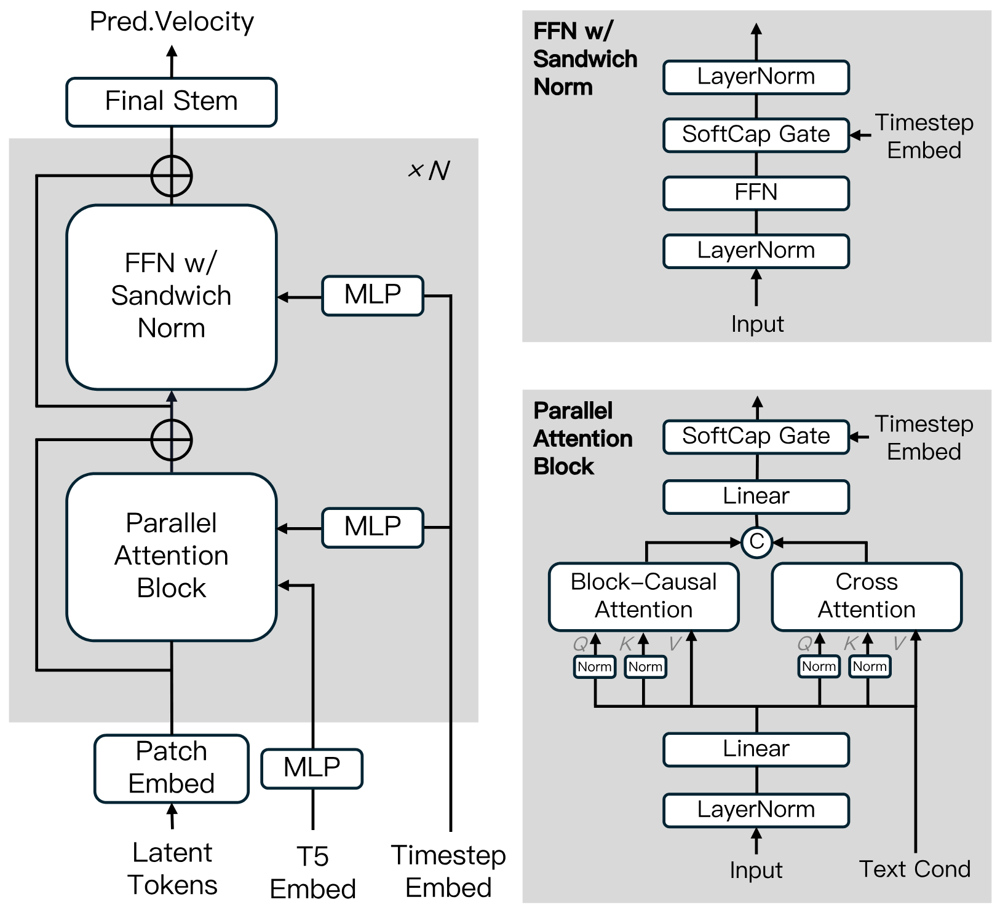
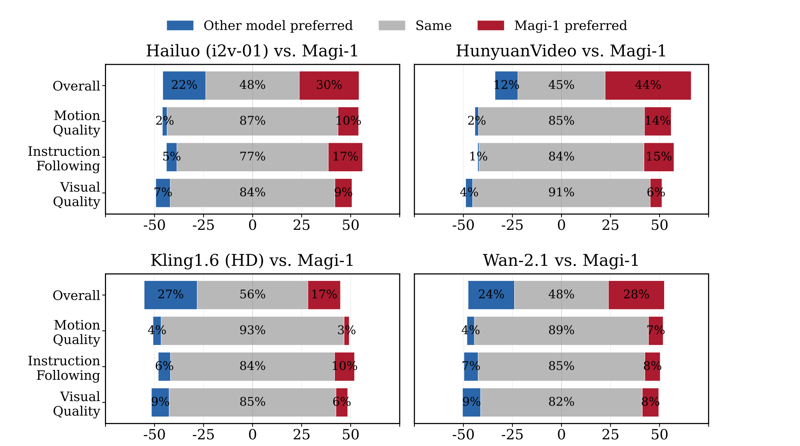

-----

<p align="center">
    <a href="https://arxiv.org/abs/2505.13211"></a>
    <a href="https://sand.ai"></a>
    <a href="https://magi.sand.ai"></a>
    <a href="https://huggingface.co/sand-ai"></a>
     <a href="https://x.com/SandAI_HQ"></a>
    <a href="https://discord.gg/hgaZ86D7Wv"></a>
    <a href="https://github.com/SandAI-org/MAGI-1/LICENSE"></a>
</p>

# MAGI-1: Autoregressive Video Generation at Scale

This repository contains the code for the MAGI-1 model, pre-trained weights and inference code. You can find more information on our [technical report](https://static.magi.world/static/files/MAGI_1.pdf) or directly create magic with MAGI-1 [here](http://sand.ai) . 🚀✨


## 🔥🔥🔥 Latest News

- May 26, 2025: MAGI-1 4.5B distill and distill+quant models has been released 🎉 — we’ve updated the model weights - check it out!
- May 14, 2025: Added Dify DSL for prompt enhancement 🎉 — import it into Dify to boost prompt quality!
- Apr 30, 2025: MAGI-1 4.5B model has been released 🎉. We've updated the model weights — check it out!
- Apr 21, 2025: MAGI-1 is here 🎉. We've released the model weights and inference code — check it out!


## 1. About

We present MAGI-1, a world model that generates videos by ***autoregressively*** predicting a sequence of video chunks, defined as fixed-length segments of consecutive frames. Trained to denoise per-chunk noise that increases monotonically over time, MAGI-1 enables causal temporal modeling and naturally supports streaming generation. It achieves strong performance on image-to-video (I2V) tasks conditioned on text instructions, providing high temporal consistency and scalability, which are made possible by several algorithmic innovations and a dedicated infrastructure stack. MAGI-1 further supports controllable generation via chunk-wise prompting, enabling smooth scene transitions, long-horizon synthesis, and fine-grained text-driven control. We believe MAGI-1 offers a promising direction for unifying high-fidelity video generation with flexible instruction control and real-time deployment.

<div align="center">
  <video src="https://github.com/user-attachments/assets/5cfa90e0-f6ed-476b-a194-71f1d309903a
" width="70%" poster=""> </video>
</div>


## 2. Model Summary

### Transformer-based VAE

- Variational autoencoder (VAE) with transformer-based architecture, 8x spatial and 4x temporal compression.
- Fastest average decoding time and highly competitive reconstruction quality

### Auto-Regressive Denoising Algorithm

MAGI-1 is an autoregressive denoising video generation model generating videos chunk-by-chunk instead of as a whole. Each chunk (24 frames) is denoised holistically, and the generation of the next chunk begins as soon as the current one reaches a certain level of denoising. This pipeline design enables concurrent processing of up to four chunks for efficient video generation.



### Diffusion Model Architecture

MAGI-1 is built upon the Diffusion Transformer, incorporating several key innovations to enhance training efficiency and stability at scale. These advancements include Block-Causal Attention, Parallel Attention Block, QK-Norm and GQA, Sandwich Normalization in FFN, SwiGLU, and Softcap Modulation. For more details, please refer to the [technical report.](https://static.magi.world/static/files/MAGI_1.pdf)
<div align="center">

</div>

### Distillation Algorithm

We adopt a shortcut distillation approach that trains a single velocity-based model to support variable inference budgets. By enforcing a self-consistency constraint—equating one large step with two smaller steps—the model learns to approximate flow-matching trajectories across multiple step sizes. During training, step sizes are cyclically sampled from {64, 32, 16, 8}, and classifier-free guidance distillation is incorporated to preserve conditional alignment. This enables efficient inference with minimal loss in fidelity.


## 3. Model Zoo

We provide the pre-trained weights for MAGI-1, including the 24B and 4.5B models, as well as the corresponding distill and distill+quant models. The model weight links are shown in the table.

| Model                         | Link                                                                 | Recommend Machine             |
| ------------------------------ | -------------------------------------------------------------------- | ------------------------------- |
| T5                             | [T5](https://huggingface.co/sand-ai/MAGI-1/tree/main/ckpt/t5)        | -                               |
| MAGI-1-VAE                     | [MAGI-1-VAE](https://huggingface.co/sand-ai/MAGI-1/tree/main/ckpt/vae) | -                               |
| MAGI-1-24B                     | [MAGI-1-24B](https://huggingface.co/sand-ai/MAGI-1/tree/main/ckpt/magi/24B_base) | H100/H800 × 8                   |
| MAGI-1-24B-distill              | [MAGI-1-24B-distill](https://huggingface.co/sand-ai/MAGI-1/tree/main/ckpt/magi/24B_distill) | H100/H800 × 8                   |
| MAGI-1-24B-distill+fp8_quant    | [MAGI-1-24B-distill+quant](https://huggingface.co/sand-ai/MAGI-1/tree/main/ckpt/magi/24B_distill_quant) | H100/H800 × 4 or RTX 4090 × 8    |
| MAGI-1-4.5B                    | [MAGI-1-4.5B](https://huggingface.co/sand-ai/MAGI-1/tree/main/ckpt/magi/4.5B_base) | RTX 4090 × 1                    |
| MAGI-1-4.5B-distill             | [MAGI-1-4.5B-distill](https://huggingface.co/sand-ai/MAGI-1/tree/main/ckpt/magi/4.5B_distill) | RTX 4090 × 1                    |
| MAGI-1-4.5B-distill+fp8_quant   | [MAGI-1-4.5B-distill+quant](https://huggingface.co/sand-ai/MAGI-1/tree/main/ckpt/magi/4.5B_distill_quant) | RTX 4090 × 1                    |

> [!NOTE]
>
> For 4.5B models, any machine with at least 24GB of GPU memory is sufficient.
> If GPU memory is more constrained, you can instead run the 4.5B-distill+fp8_quant model by setting the `window_size` parameter to 1 in the `4.5B_distill_quant_config.json` file. This configuration works on GPUs with at least 12GB of memory.

## 4. Evaluation

### In-house Human Evaluation

MAGI-1 achieves state-of-the-art performance among open-source models like Wan-2.1 and HunyuanVideo and closed-source model like Hailuo (i2v-01), particularly excelling in instruction following and motion quality, positioning it as a strong potential competitor to closed-source commercial models such as Kling.



### Physical Evaluation

Thanks to the natural advantages of autoregressive architecture, Magi achieves far superior precision in predicting physical behavior on the [Physics-IQ benchmark](https://github.com/google-deepmind/physics-IQ-benchmark) through video continuation—significantly outperforming all existing models.

| Model          | Phys. IQ Score ↑ | Spatial IoU ↑ | Spatio Temporal ↑ | Weighted Spatial IoU ↑ | MSE ↓  |
|----------------|------------------|---------------|-------------------|-------------------------|--------|
| **V2V Models** |                  |               |                   |                         |        |
| **Magi-24B (V2V)** | **56.02**        | **0.367**     | **0.270**         | **0.304**               | **0.005** |
| **Magi-4.5B (V2V)** | **42.44**        | **0.234**     | **0.285**         | **0.188**               | **0.007** |
| VideoPoet (V2V)| 29.50            | 0.204         | 0.164             | 0.137                   | 0.010  |
| **I2V Models** |                  |               |                   |                         |        |
| **Magi-24B (I2V)** | **30.23**        | **0.203**     | **0.151**         | **0.154**               | **0.012** |
| Kling1.6 (I2V) | 23.64            | 0.197         | 0.086             | 0.144                   | 0.025  |
| VideoPoet (I2V)| 20.30            | 0.141         | 0.126             | 0.087                   | 0.012  |
| Gen 3 (I2V)    | 22.80            | 0.201         | 0.115             | 0.116                   | 0.015  |
| Wan2.1 (I2V)   | 20.89            | 0.153         | 0.100             | 0.112                   | 0.023  |
| Sora (I2V)     | 10.00            | 0.138         | 0.047             | 0.063                   | 0.030  |
| **GroundTruth**| **100.0**        | **0.678**     | **0.535**         | **0.577**               | **0.002** |


## 5. How to run

### Environment Preparation

We provide two ways to run MAGI-1, with the Docker environment being the recommended option.

**Run with Docker Environment (Recommend)**

```bash
docker pull sandai/magi:latest

docker run -it --gpus all --privileged --shm-size=32g --name magi --net=host --ipc=host --ulimit memlock=-1 --ulimit stack=6710886 sandai/magi:latest /bin/bash
```

**Run with Source Code**

```bash
# Create a new environment
conda create -n magi python==3.10.12

# Install pytorch
conda install pytorch==2.4.0 torchvision==0.19.0 torchaudio==2.4.0 pytorch-cuda=12.4 -c pytorch -c nvidia

# Install other dependencies
pip install -r requirements.txt

# Install ffmpeg
conda install -c conda-forge ffmpeg=4.4

# For GPUs based on the Hopper architecture (e.g., H100/H800), it is recommended to install MagiAttention(https://github.com/SandAI-org/MagiAttention) for acceleration. For non-Hopper GPUs, installing MagiAttention is not necessary.
git clone git@github.com:SandAI-org/MagiAttention.git
cd MagiAttention
git submodule update --init --recursive
pip install --no-build-isolation .
```

### Inference Command

To run the `MagiPipeline`, you can control the input and output by modifying the parameters in the `example/24B/run.sh` or `example/4.5B/run.sh` script. Below is an explanation of the key parameters:

#### Parameter Descriptions

- `--config_file`: Specifies the path to the configuration file, which contains model configuration parameters, e.g., `example/24B/24B_config.json`.
- `--mode`: Specifies the mode of operation. Available options are:
  - `t2v`: Text to Video
  - `i2v`: Image to Video
  - `v2v`: Video to Video
- `--prompt`: The text prompt used for video generation, e.g., `"Good Boy"`.
- `--image_path`: Path to the image file, used only in `i2v` mode.
- `--prefix_video_path`: Path to the prefix video file, used only in `v2v` mode.
- `--output_path`: Path where the generated video file will be saved.

#### Bash Script

```bash
#!/bin/bash
# Run 24B MAGI-1 model
bash example/24B/run.sh

# Run 4.5B MAGI-1 model
bash example/4.5B/run.sh
```

#### Customizing Parameters

You can modify the parameters in `run.sh` as needed. For example:

- To use the Image to Video mode (`i2v`), set `--mode` to `i2v` and provide `--image_path`:
  ```bash
  --mode i2v \
  --image_path example/assets/image.jpeg \
  ```

- To use the Video to Video mode (`v2v`), set `--mode` to `v2v` and provide `--prefix_video_path`:
  ```bash
  --mode v2v \
  --prefix_video_path example/assets/prefix_video.mp4 \
  ```

By adjusting these parameters, you can flexibly control the input and output to meet different requirements.

### Some Useful Configs (for config.json)

> [!NOTE]
>
> - If you are running 24B model with RTX 4090 \* 8, please set `pp_size:2 cp_size: 4`.
>
> - Our model supports arbitrary resolutions. To accelerate inference process, the default resolution for the 4.5B model is set to 720×720 in the `4.5B_config.json`.

| Config         | Help                                                         |
| -------------- | ------------------------------------------------------------ |
| seed           | Random seed used for video generation                        |
| video_size_h   | Height of the video                                          |
| video_size_w   | Width of the video                                           |
| num_frames     | Controls the duration of generated video                     |
| fps            | Frames per second, 4 video frames correspond to 1 latent_frame |
| cfg_number     | Base model uses cfg_number==3, distill and quant model uses cfg_number=1 |
| load           | Directory containing a model checkpoint.                     |
| t5_pretrained  | Path to load pretrained T5 model                             |
| vae_pretrained | Path to load pretrained VAE model                            |

## 6. Prompt Enhancement

To improve prompt quality, we provide a [Dify DSL](/assets/prompt_enhancement_dify_dsl.yml) file that can be imported directly into [Dify](https://dify.ai/) to set up a prompt enhancement pipeline. If you’re new to Dify, see [how to create an app from a DSL file](https://docs.dify.ai/en/guides/application-orchestrate/creating-an-application#creating-from-a-dsl-file) to get started.

## 7. License

This project is licensed under the Apache License 2.0 - see the [LICENSE](LICENSE) file for details.

## 8. Citation

If you find our code or model useful in your research, please cite:

```bibtex
@misc{ai2025magi1autoregressivevideogeneration,
      title={MAGI-1: Autoregressive Video Generation at Scale},
      author={Sand. ai and Hansi Teng and Hongyu Jia and Lei Sun and Lingzhi Li and Maolin Li and Mingqiu Tang and Shuai Han and Tianning Zhang and W. Q. Zhang and Weifeng Luo and Xiaoyang Kang and Yuchen Sun and Yue Cao and Yunpeng Huang and Yutong Lin and Yuxin Fang and Zewei Tao and Zheng Zhang and Zhongshu Wang and Zixun Liu and Dai Shi and Guoli Su and Hanwen Sun and Hong Pan and Jie Wang and Jiexin Sheng and Min Cui and Min Hu and Ming Yan and Shucheng Yin and Siran Zhang and Tingting Liu and Xianping Yin and Xiaoyu Yang and Xin Song and Xuan Hu and Yankai Zhang and Yuqiao Li},
      year={2025},
      eprint={2505.13211},
      archivePrefix={arXiv},
      primaryClass={cs.CV},
      url={https://arxiv.org/abs/2505.13211},
}
```

## 9. Contact

If you have any questions, please feel free to raise an issue or contact us at [research@sand.ai](mailto:research@sand.ai) .
